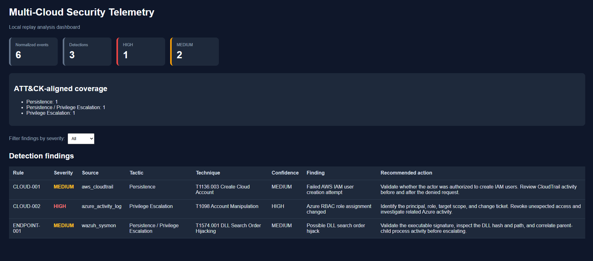

# Multi-Cloud Telemetry & Log Aggregation

A zero-cost, local-first security telemetry pipeline that normalizes AWS CloudTrail, Azure Activity Log, and Wazuh/Sysmon alerts into one schema, applies deterministic detections, and generates structured analyst outputs.



## Highlights

- Multi-source ingestion for AWS, Azure, and Wazuh/Sysmon event formats
- Shared normalized event schema that preserves original source context
- Deterministic, ATT&CK-aligned security detections
- Confidence levels and recommended analyst actions for every finding
- Batch CLI for replaying multiple telemetry events
- JSONL event and detection output plus a JSON summary
- Standalone HTML dashboard with severity filtering
- Docker support and GitHub Actions test automation
- 16 automated unit tests
- Strict zero-cost design: live endpoint validation plus safe local cloud replay

## Architecture

```mermaid
flowchart TD
    A["AWS CloudTrail fixture"] --> D["Source routing and adapters"]
    B["Azure Activity Log fixture"] --> D
    C["Wazuh / Sysmon fixture"] --> D

    D --> E["NormalizedEvent schema"]
    E --> F["Detection engine"]
    E --> G["normalized_events.jsonl"]
    F --> H["detections.jsonl"]
    F --> I["summary.json"]
    F --> J["dashboard.html"]
