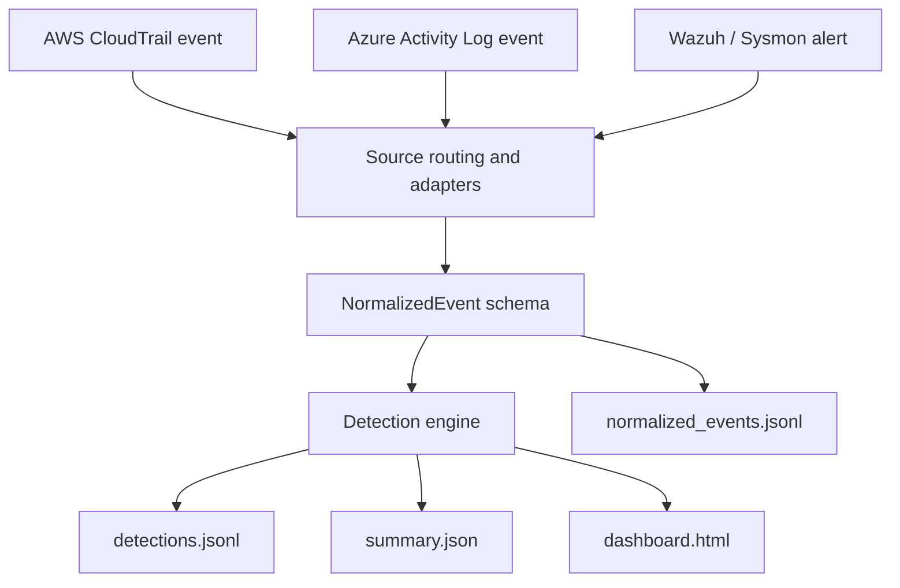
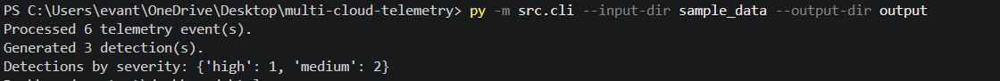

# Multi-Cloud Telemetry & Log Aggregation

A zero-cost, local-first security telemetry application that normalizes AWS CloudTrail, Azure Activity Log, and Wazuh/Sysmon alerts into a common schema, applies deterministic detections, and generates structured analyst outputs.


## Why this project exists

Security teams rarely investigate one log source at a time. AWS, Azure, and Windows endpoint telemetry all describe important activity, but each uses different field names, event formats, and context.

This project demonstrates a practical security-engineering approach:

1. ingest vendor-shaped telemetry;
2. normalize it into a shared event contract;
3. apply explainable detection logic;
4. retain raw source context for investigation;
5. generate findings, summary data, and a local analyst dashboard.

The goal is not to claim that every alert is malicious. The goal is to build a repeatable pipeline that helps an analyst prioritize, investigate, and document security-relevant activity.

## Project capabilities

- Routes AWS CloudTrail, Azure Activity Log, and Wazuh/Sysmon JSON automatically by event structure
- Normalizes all sources into a shared `NormalizedEvent` schema
- Preserves source-specific detail in `raw_event`
- Applies deterministic, ATT&CK-aligned detections
- Adds severity, confidence, and recommended analyst action to each finding
- Processes an entire directory of telemetry fixtures through a command-line interface
- Writes JSONL event and finding streams plus a JSON summary report
- Generates a standalone HTML dashboard with severity filtering
- Includes benign scenarios to validate that the pipeline does not alert on every event
- Runs without third-party Python packages
- Includes Docker support and a GitHub Actions test workflow

## Architecture



Detailed component design: [docs/architecture.md](docs/architecture.md)

## Data flow

```text
Raw JSON fixture
  → loader.py
  → runner.py routes the source
  → aws.py / azure.py / wazuh.py normalize the event
  → detections.py evaluates deterministic rules
  → pipeline.py writes event and detection JSONL
  → report.py builds summary data
  → dashboard.py renders analyst-facing HTML
```

### Normalized event contract

Each source adapter produces the same logical fields:

```json
{
  "timestamp": "2026-09-19T02:00:00Z",
  "source": "aws_cloudtrail",
  "actor": "arn:aws:iam::111122223333:root",
  "action": "iam.amazonaws.com:CreateUser",
  "outcome": "failure",
  "resource": null,
  "source_ip": "203.0.113.10",
  "raw_event": {}
}
```

The source-specific payload remains in `raw_event`. This is important because normalization makes cross-source analytics possible, but raw context is still needed for investigation.

## Detection coverage

| Rule ID | Severity | Signal | ATT&CK mapping | Analyst response |
|---|---:|---|---|---|
| `CLOUD-001` | Medium | Denied AWS IAM user creation attempt | `T1136.003 Create Cloud Account` | Validate authorization and review surrounding CloudTrail activity |
| `CLOUD-002` | High | Successful Azure RBAC role assignment change | `T1098 Account Manipulation` | Identify principal, role, scope, change approval, and unexpected access |
| `ENDPOINT-001` | Medium | Wazuh rule 92219: possible DLL search-order hijack | `T1574.001 DLL Search Order Hijacking` | Validate executable signature, DLL path/hash, and process lineage |

These rules are deliberately deterministic and explainable. They are not automated containment actions.

## Detection quality

The sample set includes six events:

| Source | Alerting scenario | Benign/no-alert scenario |
|---|---|---|
| AWS | Failed IAM `CreateUser` request | Successful console login |
| Azure | Successful RBAC role-assignment change | Resource-group creation |
| Wazuh/Sysmon | Rule 92219 DLL search-order condition | Generic Wazuh event |

The expected result is **6 normalized events and 3 findings**. This proves the pipeline can distinguish defined security signals from routine activity rather than treating every event as suspicious.



## Dashboard

The generated dashboard provides a compact analyst view of:

- total normalized events and detections;
- high and medium severity counts;
- ATT&CK-aligned coverage;
- technique and confidence data;
- recommended actions;
- client-side filtering by severity.

Run the pipeline, then open:

```text
output/dashboard.html
```

## Run locally

### Requirements

- Windows, macOS, or Linux
- Python 3.10 or later
- No third-party Python dependencies

### Validate and run

```powershell
py -m unittest discover -s tests -v
py -m src.cli --input-dir sample_data --output-dir output
Start-Process output\dashboard.html
```

Expected output:

```text
Ran 16 tests
OK

Processed 6 telemetry event(s).
Generated 3 detection(s).
Detections by severity: {'high': 1, 'medium': 2}
Dashboard: output\dashboard.html
```

## Containerized execution

```powershell
docker build -t multi-cloud-telemetry .
docker run --rm -v "${PWD}\output:/app/output" multi-cloud-telemetry
```

The container runs the same CLI pipeline and writes generated output to the mounted `output` directory.

## Repository layout

```text
src/          Application code: routing, adapters, detections, reporting, dashboard
tests/        Automated unit tests
sample_data/  Sanitized AWS, Azure, and Wazuh/Sysmon event fixtures
output/       Generated JSONL, summary, and HTML dashboard artifacts
docs/         Architecture, production design, and SOC triage documentation
.github/      GitHub Actions test workflow
```

## Live validation and zero-cost design

This project intentionally separates what was validated live from what is replayed locally:

- **Live lab validation:** Windows Sysmon telemetry was collected through Wazuh.
- **Verified cloud sources:** AWS CloudTrail Event History and Azure Activity Log were accessed and reviewed.
- **Local replay pipeline:** Sanitized AWS, Azure, and Wazuh-shaped JSON fixtures exercise the same normalization, detection, reporting, and dashboard path.

Automated continuous export of AWS and Azure logs can introduce storage, ingestion, streaming, or compute charges. The local replay approach keeps the project strictly zero-cost while still demonstrating the engineering design and security logic.

Production delivery options, associated cost considerations, and security controls are documented in [docs/production-readiness.md](docs/production-readiness.md).

## SOC triage example

`ENDPOINT-001` is based on Wazuh rule 92219, a possible DLL search-order hijack condition.

The relevant lab event involved a validly signed Windows process and compatibility-related behavior. That context matters: the alert is evidence to review, not proof of compromise. The project documents the triage reasoning, investigation steps, and conclusion in [docs/triage-walkthrough.md](docs/triage-walkthrough.md).

## Validation and engineering practices

The project contains 16 automated tests covering:

- AWS, Azure, and Wazuh/Sysmon normalization
- JSON fixture loading
- Source routing and multi-event batch processing
- Event, detection, summary, and dashboard generation
- ATT&CK detection metadata
- Benign/no-alert scenarios

A GitHub Actions workflow runs the test suite on pushes and pull requests.

## Future enhancements

The current version is intentionally local-first. A production extension could replace fixture replay with automated ingestion:

- AWS CloudTrail delivery through S3 or EventBridge
- Azure Activity Log export through Event Hub or Log Analytics
- Wazuh API or index export
- Centralized searchable storage and alert delivery
- Additional detections, enrichment, and case-management integration

Those changes would modify the ingestion layer while preserving the existing normalization, detection, reporting, and dashboard layers.

## License

Released under the [MIT License](LICENSE).
